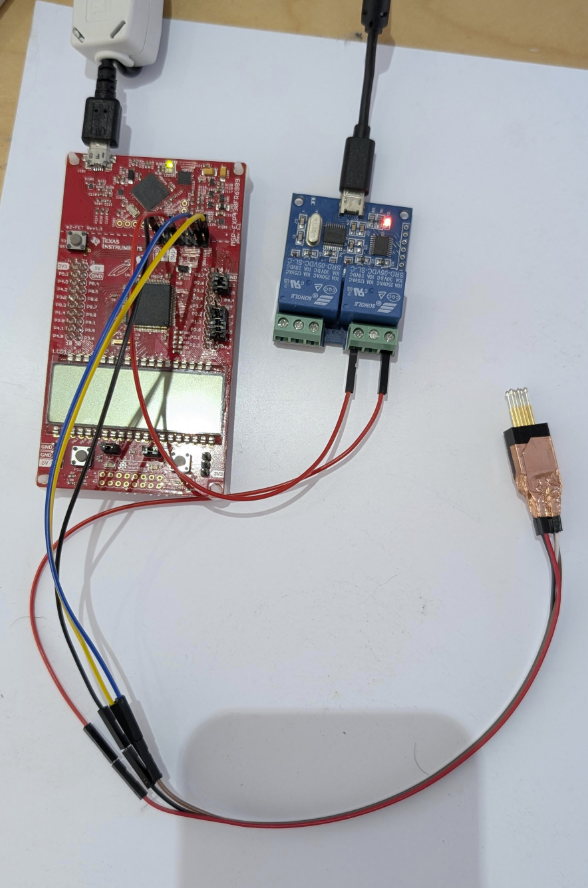

# PROGRAMMING

## One-time Set up

### Software
 1. Download `program.py`, 'addrow.py', `getch.py`, and `tsl-calibre-msp.txt` from a release in this repo.
 2. Install Python. (The TSL programming script is in Python)
 connections. 
 4. Install [MSPFlasher](https://www.ti.com/tool/MSP430-FLASHER). (This actually talks to the EZ-FET programming hardware)
 5. Make sure that the MSPFlasher executable is in the search path.

### Hardware

You will need a TI board with an EZFet programmer on it. There are lots and any will do. I used the MSP-EXP430FR4133.

2. Remove all of the jumpers on the programmer board and connect it to the computer via USB.
3. Connect the pins from the EZFet side of the programmer (the side closer to the USB) to the programming connector like this...
    | Programmer pin | TSL pin |
    | - | - | 
    | G | G |
    | 3V3 | V |
    | SBWTDIO | R | 
    | SBWTICK | T |
 
 #### Config

If you are not going to use the optional power test function, then you must set the envrironment variable `tsl_logscript` to `none`. 

If you are not going to use the optional logging function, then you must set the envrironment variables `tsl_rangerport` to `none` and `tsl_relayport` to `none`. 

If you are going to use these optional features, see thier sections below. 

## Commissioning Procedure
1. Run the `program.py` program.
1. Connect a new TSL board without batteries to the programming connector.
2. Enter the unit's serial number. 
2. _Confirm_ that the firmware download completes without error.
3. _Confirm_ that the TSL starts, the two LEDs flash, the display shows the 'First Start' message.
4. Disconnect the programming connector. The display should show all 8's and fade out while the unit tests its power consumption. Be sure to hold the board by the edges - just touching the LCD pins can increase the power usage enough to cause the power test to fail. 
5. Within 1 minute, install the batteries into the TSL.
6. _Confirm_ that the display shows the 'Load Pin' message.
7. Assemble the TSL into the tube.
8. Insert the pull pin.
9. The display should show 'Arming' followed by the `Ready To Launch Mode` dancing dashes animation.
9. _Confirm_ that the dancing dashes display lights all the LCD segments and that it updates steadily once per second. 
10. Pack it up and ship it out!

Reject the unit if it fails any of the _confirm_ steps above.

## Optional features

### Logging spreadsheet

We optionally keep a record of every TSL programming event in a google sheet using a google app script. 

If you do not want to use this feature, set the environment variable `tsl_logscript` to `none`.

If you do want to use logging...

6. Create a google spreadhseet with 5 columns and give them names like "Timestamp",	"Device Serial Number",	"Device UUID",	"Firmware Hash", "Programmer Mac Address" and freeze the top row.
 7. Add a webapp to the sheet with "Extentions->Appscript" and paste the code from `addrow-appscript.gs` (in this folder) into the code editor.
 8. Click "Deploy->New Deploy" and select "Run as" you and "Allow anyone".
 9. Click "Deploy" and copy the URL it gives you. 
 9. Set the envrironment variable `tsl_logscript` to this URL. 
  
### Automatic relay power controller

You can otionally use an external relay to connect and disconnect power to the TSL being programmed. This is nice becuase (1) it makes sure that the pins are not powered when you are handling
things, so less change to short somehting out, and (2) it makes the diconnect event very decisive and consistant so you get a good current measurement on the first power-down. 

#### Hardware

1. A USB relay board. I used [this one from Amazon](https://amzn.to/40phLwM). If you use a different one with a different protocol then you might need to update `relay_set()` function in the code. 
3. Maybe a USB hub. 

#### Config

3. Install PySerial with `pip install pyserial`. This lets us acces the relay over serial 
2. Figure out what portthe relay shows up as on the machine. You can use the included `listports.py` to list possible choices.
3. Set the envronment variable `tsl_relayport` to the correct port name. In Windows, you can use the `setx` command like this...  
`setx tsl_rangerport COM3 /m`  
Note that you will need to close the current command windows and open a new one to get thes new variables, or you can additionaly use `set` to set them in the current window. 

##### Assembly

Put the relay in series with the power line going between the programmer and the TSL. Use the COM1 and NO1 pins on the relay (so the line is *disconnected* normally and connected when the relay is closed.

It looks a little somehting like this...

